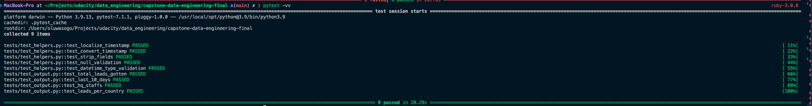
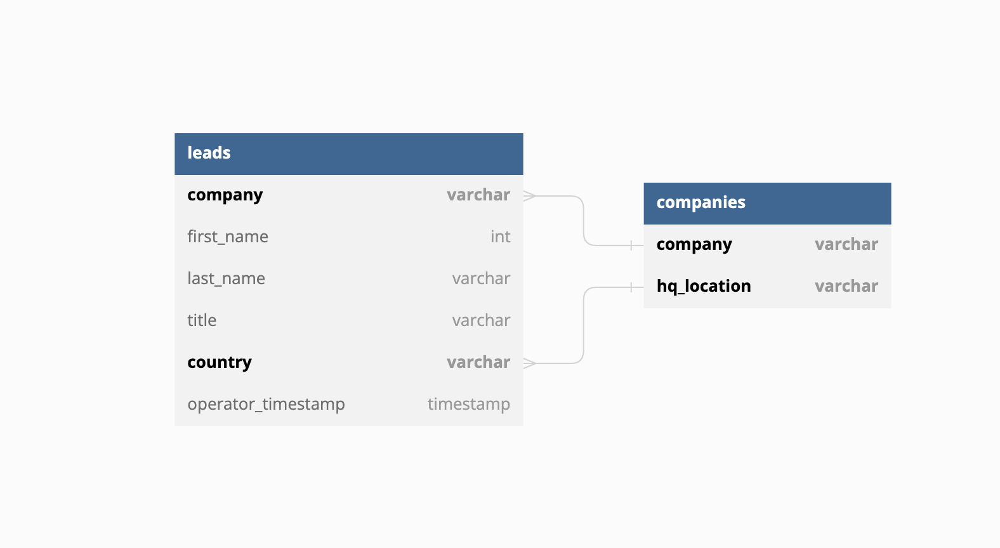

# Lead Export Pipeline (Udacity Capstone)

## Scope of Project


The pipeline in this project ingests data from google sheeet (or csv possible case when API fails), transforms it and loads it into a parquet file.  The sheet/csv is usally prefilled manually by human operators. The data used in this project are  `leads` and `companies`. The `leads` represent staffs currently working at various companies, with their names, title/position, location and the time the operator fetched the data to the sheet. The companies data is more or less a static data, which contains companies of intesrest and thier headquater locations across different countries. The end goal of the pipeline is to be able to answer the following questions that the insight and marketing team are interested in:
* Total number leads gotten each month in the current year
* The number leads captured in the past 10 days
* Top 20 countries with the highest leads so far
* How many staffs are in the HQ of company?

The above questions are answered via the spark queries in the transformer's script.
N.B:
* A lead refers to a unique staff  at a company in the `leads` data


## Tools
* GSpread - API SDK for Google Sheets
* Spark - Big Data Handling
* Jupyterlab - Notebook and lab tests
* Pytest - Unittesting tool
* Pandas - Handling small logics for data prepration


## Data
* Input data for `companies` is `companies_export.csv`
* Input data for `leads` is `leads_export.json` and the Google Sheet `API`

## Workflow
There are two notebooks in this project for lab work i.e testing phase `lead_export_part_1.ipynb` and `lead_export_part_2.ipynb`. `lead_export_part_1.ipynb` contains the logic that initially ingests the data from the csv/google sheet and in turn cleans, formats and validates it for the next step. `lead_export_part_2.ipynb` the main goal of this is to be able to answer the  4 questions of interest via spark and save the output into a parquet file for future reference. The content of the two processes are split into two tasks in the main dag `get_leads` and `load_leads_to_parquet` respectively. The `tests` folder contain unit-tests that helps validate the helper functions used in the project. The `dags/utils/helpers.py` contains the helpers used in implementing the logics for the porject while the `dags/utils/transformers.py` contains the logics for the data ingestion from sheets/csv, answering the core questions and saving logic to parquet. Output from the dag can be seen in `dags/output/`.


 This pipeline is scheduled to run daily by 7am as set in the dag config scheduler `schedule_interval="0 7 * * *"`. **On failure**, there's an automated retry and also automated email to notifier engineers to look into the issue if a retry will not solve the problem. The dashboard uses the current date time to retrieve what to be displayed hence, the dashboard will not display anything for the day if the dag fails until the dag is fixed, which is why there is an automated retry and email on failure to notify data engineers. These parameters were set in the dag:
 ```json
    "email": ["dowolebolu@gmail.com"],
    "email_on_failure": True,
    "email_on_retry": True,
 ```

N.B: **A cost effective way that would not require 100 connections for 100 people at the same time will be to use a dashboard tool like Metabase/Redash which will connect to the db source once, and will not require multi[le connections from individuals but will just require login details to the platform itself.**

### Test Image



## Data Model
Since this data does not contain a unique identifier, like a primary key, we hold an assumption for `leads` data that fields `company, first_name, last_name and country` should be unique. For the `companies` data, `company and hq_location` should be unique. Duplicates are dropped via these columns. This assumptions are the building blocks for constraints in this project.


## Data Dictionary

### Leads Data

| Field |  Type   | Description | Example|
| ----- | ------ | ------------ | --------
| company | string | the company name | Smith PLC |
| first_name | string | lead's first name | John
| last_name | string | ead's last name | Blardo
| title | string | lead's position in current company | CTO
| operator_timestamp | timestamp | time human operator dumped the data on the sheet | 2022-11-15 00:00:00


### Company Data

| Field |  Type   | Description | Example|
| ----- | -------- | ----------- | -------
| company | string | the company name | Smith PLC |
| hq_location | string | headquarter (country) of company| Congo 

## Advantage of this pipeline
This pipeline automates data cleaning, ingestion  and answers to major questions that insight and marketing team are interested in, in a very seamless way.

## Scaling up 100x
If the data for this pipeline goes up by 100%, the approach for this project will be altered to some extent. The following are some of the improvements that will be implemented:
* Make use of s3 form storing the parquet output
* Use EMR cluster to host the spark jobs
* Use spark hooks to trigger jobs on EMR
* Use only spark for all processing
* Google sheet will not be able to take 100million rows, so an alternative like s3 or cloudstorage will do for data input.


NB: Because the size of this file is large, the lead_data.json and lead_export.csv have been moved to a [google drive](https://drive.google.com/drive/folders/1d36hJWSRgJLlPiLjFqyywexBjsksKKeB?usp=share_link)